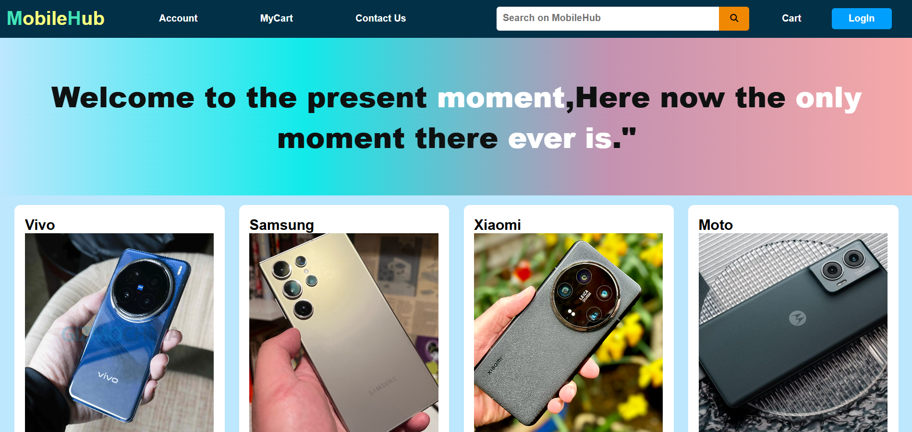

# MobileHub Website

**MobileHub** is a basic front-end web project built using **HTML5** and **CSS3**.It displays a collection of mobile phones from top brands such as Vivo,Samsung,Xiaomi,and Motorola.Each phone card includes essential details like model name,RAM/ROM,camera information,and pricing.

**This is my simple UI design created just for practicing HTML and CSS.**

This was my first project while learning HTML and CSS,And it helped me understand how to structure a web page,style components,and use layout techniques.

---

## Live Demo
[Click here to view the live site](https://ibrahimpatel-63.github.io/MobileHub-Website/)

## Screenshot

## Features

- showcases multiple mobile models from different brands.
- Each card displays:
- Brand Name
- Model Name
- RAM and Storage
- Price 
- Fully designed layout using HTML and CSS only.
- Simple and clean design 
- Includes:
- Navigation Bar
- Footer
- Motivational Quote section

## Tech Stack

- HTML5
- CSS3

---

